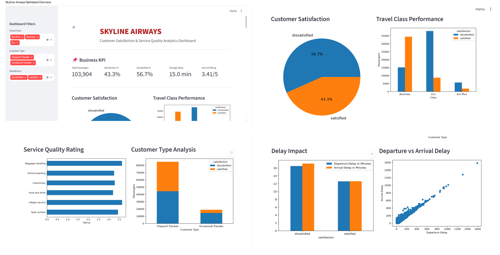

# ✈️ Skyline Airways Customer Satisfaction Analysis

A complete Data Analytics project built using **Python, Streamlit, Excel, Pandas, Matplotlib, and GitHub** to analyze airline passenger satisfaction and service quality.

The dashboard helps management understand customer satisfaction, travel class performance, service ratings, customer behavior, and flight delays through interactive visualizations.

---

## 📌 Project Overview

Customer satisfaction is one of the most important success factors in the airline industry. Airlines receive thousands of passenger reviews every day, making it difficult to identify the key reasons behind customer satisfaction and dissatisfaction.

This project analyzes airline passenger data to identify:

- Customer satisfaction level
- Service quality performance
- Flight delay impact
- Travel class performance
- Customer type analysis
- Business recommendations

An interactive **Streamlit Dashboard** allows users to filter data and explore insights in real time.

---

# 📊 Dashboard Preview

The dashboard provides an interactive overview of business KPIs, customer satisfaction, travel class performance, service quality, delay analysis, and customer segmentation.

<p align="center">

</p>

---

# 🎯 Business Problem

Airlines need to improve passenger satisfaction while maintaining operational efficiency.

However, management often struggles to identify:

- Which passengers are satisfied?
- Which travel class performs better?
- Which services require improvement?
- How delays affect customer experience?
- Which customer segment is most valuable?

This dashboard answers these business questions using data-driven insights.

---

# 🎯 Project Objectives

- Analyze airline passenger satisfaction.
- Evaluate service quality ratings.
- Compare travel class performance.
- Study the impact of flight delays.
- Analyze frequent and occasional travelers.
- Build an interactive dashboard for business users.

---

# 📁 Dataset Information

**Dataset:** Airline Passenger Satisfaction Dataset

**Rows:** 103,904

**Columns:** 24

The dataset contains:

- Passenger Demographics
- Travel Class
- Customer Type
- Flight Delays
- Service Ratings
- Overall Satisfaction

---

# 🛠 Tools & Technologies

| Tool | Purpose |
|-------|----------|
| Python | Data Analysis |
| Pandas | Data Cleaning |
| Matplotlib | Data Visualization |
| Streamlit | Interactive Dashboard |
| Excel | Dataset Preparation |
| Git & GitHub | Version Control |

---

# 📈 Dashboard Features

### 📌 Business KPIs

The dashboard displays:

- Total Passengers
- Satisfaction Percentage
- Dissatisfaction Percentage
- Average Flight Delay
- Overall Service Rating

---

### 📊 Customer Satisfaction

Displays the percentage of satisfied and dissatisfied passengers.

Business Value:

- Measures overall customer happiness.
- Helps management monitor customer experience.

---

### 📊 Travel Class Performance

Compares satisfaction across:

- Business Class
- Eco Class
- Eco Plus

Business Value:

- Identifies the best-performing travel class.
- Helps improve lower-performing classes.

---

### ⭐ Service Quality Rating

Shows average ratings for:

- Seat Comfort
- Food & Drink
- Inflight Service
- Online Boarding
- Cleanliness
- Baggage Handling

Business Value:

- Identifies services that require improvement.
- Supports customer experience initiatives.

---

### 👥 Customer Type Analysis

Compares:

- Frequent Travelers
- Occasional Travelers

Business Value:

- Understands customer loyalty.
- Helps create personalized marketing strategies.

---

### ⏱ Delay Impact Analysis

Compares:

- Departure Delay
- Arrival Delay

Business Value:

- Measures how delays affect customer satisfaction.
- Helps improve operational efficiency.

---

### 📉 Departure vs Arrival Delay

Scatter plot showing the relationship between departure and arrival delays.

Business Value:

- Identifies delay patterns.
- Helps airlines reduce cascading delays.

---

# 🎛 Dashboard Filters

Users can filter data by:

- Travel Class
- Customer Type
- Satisfaction

The dashboard updates all KPIs and charts instantly.

---

# 💡 Key Insights

- Business Class passengers show the highest satisfaction.
- Economy passengers are comparatively less satisfied.
- Frequent travelers represent the largest customer segment.
- Flight delays significantly impact satisfaction.
- Service ratings remain above average but still have improvement opportunities.
- Cleanliness and baggage handling receive better ratings than other services.

---

# ✅ Business Recommendations

- Improve Economy Class experience.
- Reduce departure and arrival delays.
- Enhance food and onboard services.
- Introduce loyalty rewards for frequent travelers.
- Improve digital check-in and online boarding.

---

# 📂 Project Structure

```
Airline_Passenger_Satisfaction_Analysis/

│

├── Datasets/
│ └── train.xlsx

├── Source/
│ ├── app.py
│ └── Airline_Analysis.ipynb

├── images/
│ └── dashboard_overview_combined.png

├── README.md

├── requirements.txt

└── ProblemStatement.docx
```

---

# ▶️ How to Run

Clone the repository

```bash
git clone https://github.com/yourusername/Airline_Passenger_Satisfaction_Analysis.git
```

Go to the project folder

```bash
cd Airline_Passenger_Satisfaction_Analysis
```

Install required libraries

```bash
pip install -r requirements.txt
```

Run the Streamlit application

```bash
streamlit run Source/app.py
```

---

# 📌 Future Improvements

- Power BI Dashboard
- SQL Integration
- Machine Learning Prediction
- Passenger Segmentation
- Cloud Deployment
- Live Airline Data Integration

---

# 👩‍💻 Author

**Agalya Maheswaran**

Aspiring Data Analyst

**Skills**

- Python
- SQL
- Excel
- Power BI
- Streamlit
- Pandas
- Matplotlib
- Git & GitHub

---

# ⭐ If you found this project helpful, consider giving it a Star on GitHub!

